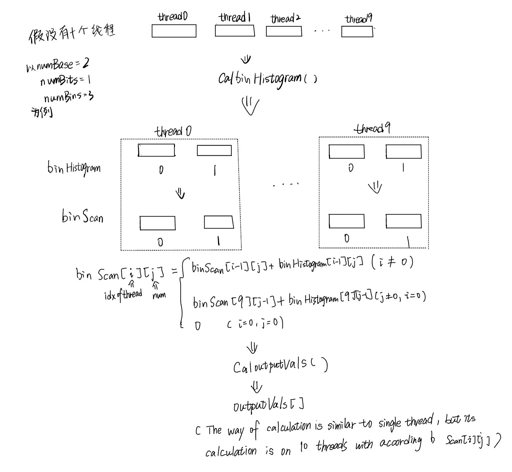

# C++ multiple threads radix sort

** Sort integer array in ascending order **

## Environment

- CPU: Intel Core i5 12400F, the number of cores is 6, the number of threads is 12. 
- MEM: 2 X 8GB
- Visual Studio 2022
- C++14

---

## Description

I only program a easy code to implement C++ Radix Sort with multiple threads concurrency. 

It only support that sort 
integer array in ascending order. And I test the run time for this concurrent radix sort.

---

## Algorithm

I will illustrat concurrent radix sort with pictures below.

In this case, I assume the number of threads is 10, numBase=2, numBits=1. 

Firstly, we calculate binHistogram[] through CalbinHistogram() function. It 
should be noted that binHistogram[] is related with thread, which means 
different threads have unique binHistogram[].

Secondly, we calculate binScan[] by formulation in above picture and then 
we calculate outputVals[] through CaloutputVals() function in 10 threads.

After synchronous, we swap inputVals[] and outputVals[] (actually assign 
outputVals[i] to inputVals[i]), so finally we get updated inputVals[] for 
next iteration.

**The rounds of iteration is up to numBits and maximum value in inputVals[].** 

**Noted that atomic operation is used to guarantee validity of binHistogram[] and binScan[].**

---

## Runtime
THREADS is 10 by default in test.

**Test1**
- Amount of data: 524288
- numBins: 21
- numBits: 1
- numBase: 2
- Runtime: 562ms

**Test2**
- Amount of data: 524288
- numBins: 6
- numBits: 1
- numBase: 10
- Runtime: 109ms

**Test3**
- Amount of data: 524288
- numBins: 6
- numBits: 1
- numBase: 100
- Runtime: 78ms(Best)

**Test4**
- Amount of data: 100000000(1e8)
- numBins: 28
- numBits: 1
- numBase: 2
- Runtime: 86172ms

**Test5**
- Amount of data: 100000000(1e8)
- numBins: 8
- numBits: 1
- numBase: 10
- Runtime: 7391ms

**Test6**
- Amount of data: 100000000(1e8)
- numBins: 8
- numBits: 1
- numBase: 100
- Runtime: 3421ms(Best)

---

## Analysis
The reason why increase numBase from 10 to 100 can get 1 times improvement in
speed of program is that we need use atomic binHistogram[] and binScan[] to 
maintain their validity. Because 10 threads may scramble them, so if we choose
10 as numBase, 10 threas will scramble 10 resources which causes occlusion. 
However, if we set numBase 100, there are 100 resources for 10 threads which 
represents less obstruction, also higher speed. 

I don't test optimal numBase for above cases, but I alter numbase from 100 
to 150 which don't bring obvious progress.

---

## Note
You should guarantee that the value of numBins is right for numBase and the max value in your input_array.