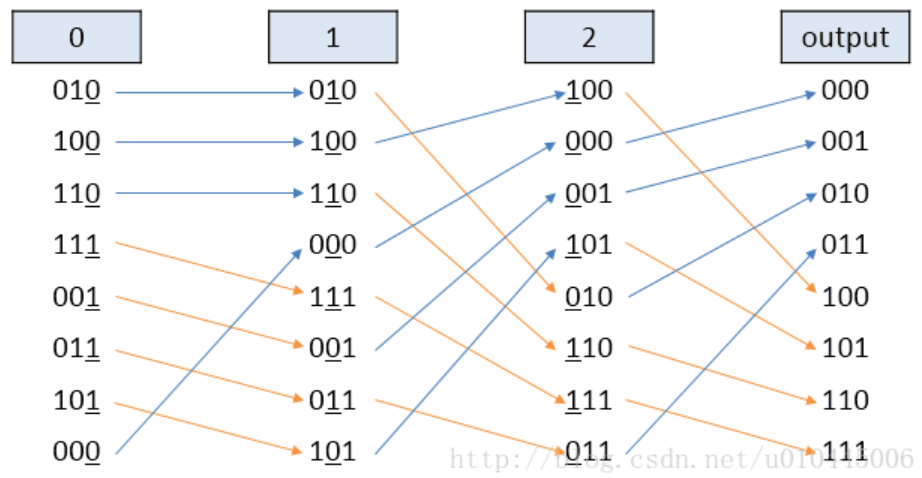

# C++ single thread radix sort

**At present, the demo witch will get ascending or descending ordered result through LSD Radix Sort Method is only suit for Integer array.**

## Environment

- CPU: Intel Core i5 12400F, the number of cores is 6, the number of threads is 12. 
- MEM: 2 X 8GB
- Visual Studio 2022
- C++14

---

## Description

You can instantiate class RadixSortTool, set number of base, number of bins(i.e. length of number in base), number of bits for one iter(i.e. added number in each iteration) by Set method.

You also can get number above throgh Get method.

When you finally set these number above, you can get sorted array through Sort method with aguments input_array(**integer array**) and size(i.e. the length of input_array).

In cpu_single_RadixSort.cpp, i give three test samples.

---
## Algorithm

The picture below show the process of radix sort vividly.

Above process of radix sort, numBase is 2, numBins is 3 and numBits is 1.

We get base index of bit through recording count of related bit in binHistogram and accumlating in binScan.

When we push a number in accrosponding bucket, we add related base index of bit. So subsequent number can be push in right position of bucket.

---

## Test case

**Test1**
- numBins: 9
- numBits: 1
- numBase: 10
- sortType: ascending
- sortMethod: LSD
- startPos: 0
- endPos: 6
- input: {981, 213, 3124, 124, 124, 656}
- output: {124, 124, 213, 656, 981, 3124}

**Test2**
- numBins: 30
- numBits: 2
- numBase: 2
- sortType: ascending
- sortMethod: LSD
- startPos: 0
- endPos: 9
- input: {1412, 12412, 1428658, 68, 8658, 56798, 568765, 679234, 355}
- output: {68, 355, 1412, 8658, 12412, 56798, 568765, 679234, 1428658}

**Test3**
- numBins: 30
- numBits: 2
- numBase: 2
- sortType: descending
- sortMethod: MSD
- startPos: 2
- endPos: 5
- input: {124 325 235 436 363 3767 898 15 85}
- output: {124 325 436 363 235 3767 898 15 85}

---

## Runtime

**Test1**
- Amount of data: 524288
- numBins: 21
- numBits: 1
- numBase: 2
- Runtime: 94ms

**Test2**
- Amount of data: 524288
- numBins: 6
- numBits: 1
- numBase: 10
- Runtime: 32ms(Best)

**Test3**
- Amount of data: 100000000(1e8)
- numBins: 28
- numBits: 1
- numBase: 2
- Runtime: 23531ms

**Test4**
- Amount of data: 100000000(1e8)
- numBins: 8
- numBits: 1
- numBase: 10
- Runtime: 7079ms(Best)

---
## Analysis

Why numBase = 10 is faster than numBase = 2, the time complexity of radix sort is O(N \* (n+m)), N is the top bit need to be check(i.e. numBins/numBits), n is the the size of input_array, m is the number of buckets(i.e. numBase*numBits).
When n >> m, O(N\*(n+m)) can be deemed as O(N\*n), so if we alter numBase from 2 to 10(i.e. alter numBins from log2(K) to log10(K), where K is the max value in input_array), we can get nearly 3 times upper in speed of program under ideal condaitions.

---
## Note

You should guarantee that the value of numBins is right for numBase and the max value in your input_array.