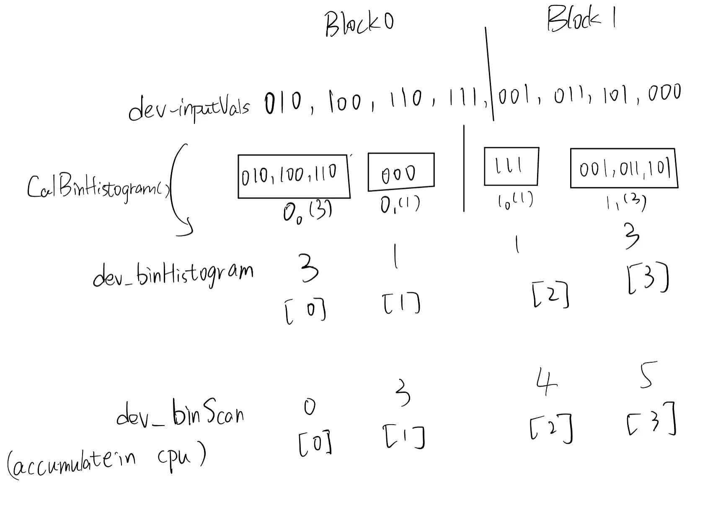
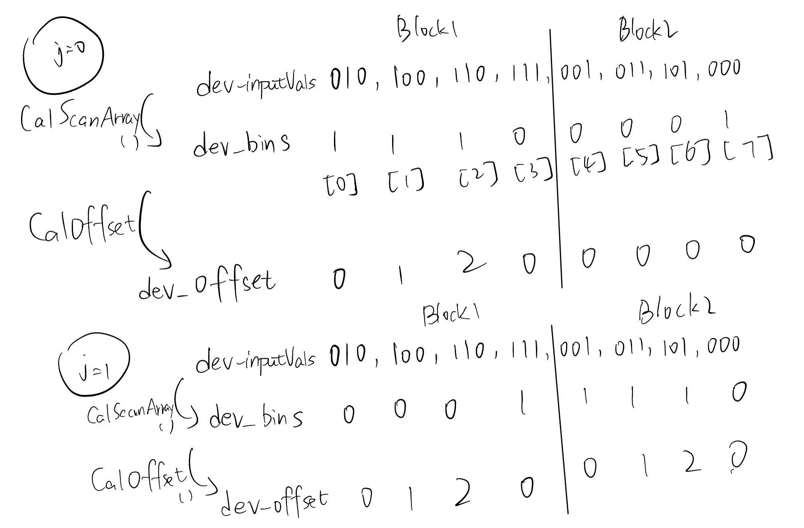
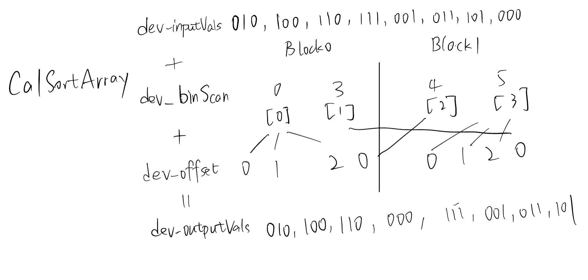
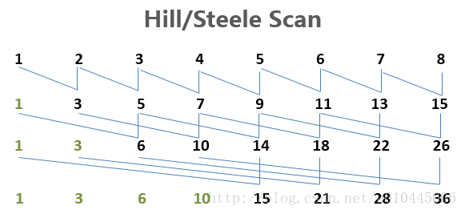

# GPU RADIX SORT

## Environment
- CPU: Intel Core i5 12400F, the number of cores is 6, the number of threads is 12
- MEM: 2 x 8GB
- GPU: NVIDIA GeForce RTX 3060 12GB
- Visual Studio 2022
- Cuda 11.8
- C++ 14

---

## Description

I have complete a gpu version of radix sort which only support ascending sort in range [0, 1e8] and out of 1e8 stack overflow may happen.

And I have test three test case and all three cases have three same parameters below which can be altered as you wish:
- numBase = 2 // radix sort in which base
- numBins = 21 // total/max refered number of bits in each number
- numBits = 1 // refered number of bits in each iterator. Actually, I don't use this value, you can think it as 1 permanently.

---
## Algorithm

I will show gpu radix sort process in 1-st iteration through pictures below, where nunBase=2, numBins=3, numBits=1.

Firstly, copy inputVals from Host to Device. Then execute CalBinHIstogram() function in Device to calculate histogram of each bits in each blocks.
After binHistogram is calculated, we copy it from Device to Host in order to calculate binScan in CPU. Because max size of thread is limited which is 1024 in GPU.

Subsequently, we can calculate offset according to the dev_bin which is calculated by CalScanArray(). 

Finally, we can get final sorted result by executing CalSortArray() with arguments dev_inputVals, dev_binScan and dev_offset. dev_binScan + dev_offset = final_position.

In addition to above process, it is important to point out that we use Hill/Steele Scan algorithm to calculate array which is similar to prefix sum.
Becaue we divide inputVals in different block, so Hill/Steele Scan is applied into corresponding block. 

---

## Test Case
 
**Test1**
- inputVals = {9, 8, 7, 6, 5, 4, 3, 2, 1, 0}
- outputVals = {0, 1, 2, 3, 4, 5, 6, 7, 8, 9}

**Test2**
- inputVals = {149124, 41283, 14765, 14624, 5523, 1244, 3523, 3252, 12532, 92580}
- outputVals = {1244, 3252, 3523, 5523, 12532, 14624, 14765, 41283, 92580, 149124}

**Test3**
- inputVals = {99999, 99998, 99997, 99996, ... , 4, 3, 2, 1, 0}
- outputVals = {0, 1, 2, 3, 4, ... , 99996, 99997, 99998, 99999}

---

## Runtime

**Test1**
- Amount of data: 524288
- Threads: 1024
- BlockSize: 512
- numBits: 1
- numBins: 21
- numBase: 2
- Runtime: 22.82067ms

**Test2**
- Amount of data: 524288
- Threads: 256
- BlockSize: 2048
- numBits: 1
- numBins: 21
- numBase: 2
- Runtime: 16.06829ms

**Test3**
- Amount of data: 524288
- Threads: 128
- BlockSize: 4096
- numBits: 1
- numBins: 6
- numBase: 10
- Runtime: 14.75859ms(Best)

**Test4**
- Amount of data: 100000000(1e8)
- Threads: 1024
- BlockSize: 97657
- numBits: 1
- numBin: 28
- numBase: 2
- Runtime: 4391.85596ms

**Test5**
- Amount of data: 100000000(1e8)
- Threads: 128
- BlockSize: 781250
- numBits: 1
- numBin: 28
- numBase: 2
- Runtime: 2878.68701ms

**Test6**
- Amount of data: 100000000(1e8)
- Threads: 128
- BlockSize: 781250
- numBits: 1
- numBin: 8
- numBase: 10
- Runtime: 2742.12793ms(Best)

---

## Note
When you change the size of array, you should check THREADS carefully to guarantee it has correct number. And the number of Threads can't be greater than **1024**. 
You also should guarantee that the value of numBins is right for numBase and the max value in your input_array.